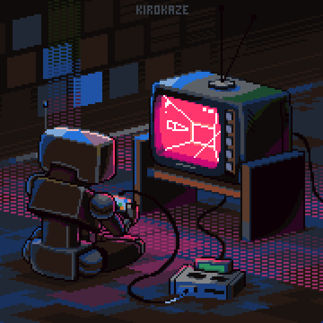

                        

<h2 align="center">📋&ensp; <i>Ｓｏｂｒｅ</i> &ensp;📋</h2>

<!-- <table align="center">
  <tr>
    <td>
      <b>
        <a href="README.md">🇧🇷 Português</a>
      </b>
    </td>
    <td>
      <a href="README-EN.md">🇺🇸 English</a>
    </td>
  </tr>
</table> -->
<ul align="left">
    <li>👋🏽 Olá, Sou um desenvolvedor Front-End, mas estudo em paralelo tecnologias de Back-end e Mobile, pois tenho o objetivo de longo prazo de me tornar Full-Stack.</li> 
    <li>🚀 Em processo de transição de carreira, sempre buscando conhecimento para poder avançar e me destacar no mercado de trabalho 🚀</li> 
    <li>🎓 Após construir sólidas bases em lógica de programação, HTML, CSS, Javascript e Git/Github, tenho evoluido em ReactJS e seu ecossistema de tecnologia, sendo algumas delas: Sass, TypeScript, Bootstrap e NodeJS. Sou formado em Engenharia Civil e em breve estarei formado em Análise e Desenvolvimento de Sistemas na UNIP.</li> 
</ul>
 

<h2 align="center">🛠️&ensp; <i>Ｔｅｃｎｏｌｏｇｉａ</i> &ensp;🛠️</h2>

<table align="right" height="295px">
 <tr>
    <td align="center">
       
      
        <b>
          <pre>ReactJS</pre>
        </b>
      
    </td>
    <td align="center">
       
      
        <b>
          <pre>Javascript</pre>
        </b>
      
    </td>
    <td align="center">
         
      
        <b>
          <pre>HTML5</pre>
      
    </td>
    <td align="center">
        
      
        <b>
          <pre>CSS3</pre>
      
    </td>
    <td align="center">
       
      
        <b>
          <pre>Bootstrap</pre>
        </b>
      
    </td>
  </tr>
    <tr>
    <td align="center">
     
      
        <b>
          <pre>Sass</pre>
        </b>
      
    </td>
    <td align="center">
       
      
        <b>
          <pre>Git</pre>
        </b>
      
    </td>
    <td align="center">
       
      
        <b>
          <pre>Github</pre>
        </b>
      
    </td>
    <td align="center">
       
      
        <b>
          <pre>Figma</pre>
        </b>
      
    </td>
    <td align="center">
       
      
        <b>
          <pre>Markdown</pre>
        </b>
      
    </td>
  </tr>
  <tr>
    <td align="center">
       
      
        <b>
          <pre>Linux / Windows</pre>
      
    </td>
    <td align="center">
       
      
        <b>
          <pre>VSCode</pre>
        </b>
      
    </td>
    <td align="center">
       
      
        <b>
          <pre>Terminal</pre>
        </b>
      
    </td>
    <td align="center">
       
      
        <b>
          <pre>SQL Server</pre>
        </b>
      
    </td>
  </tr>
</table> 
               

<h2 align="center">💬&ensp; <i>Ｃｏｎｔａｔｏ</i> &ensp;💬</h2>

  

  
   
   
   
  
  <a href="https://www.instagram.com/johnatandjesus/" alt="Instagram" target="_blank">
    

   

<h2 align="center">👨🏻‍💻&ensp; <i>Ｐｒｏｊｅｔｏｓ</i> &ensp;👨🏻‍💻</h2>

<table height="495px" width="365px">
  <tr>
    <td>
    
    </td>
  </tr>
  <tr>
    <td>
    
    </td>
  </tr>
  <tr>
    <td>
    
    </td>
  </tr>
  <tr>
    <td>
      
    </td>
  </tr>
  <tr>
    <td>
    
    </td>
  </tr>
  <tr>
    <td>
    
    </td>
  </tr>
  <tr>
    <td>
    
    </td>
  </tr>
  <tr>
    <td>
     
    </td>
  </tr>
  <tr>
    <td>
    
    </td>
  </tr>

</table>
 

<h2 align="center">

📈&ensp; <i>Ａｔｉｖｉｄａｄｅ</i> &ensp;📈

 

  

 

